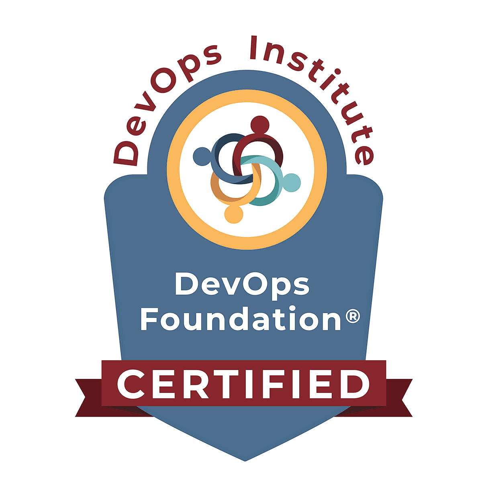

### Hi there, I am Samuel Cabral Cruz 👋

### I'm a problem solver and software engineer living in Québec, Canada.

- 🔭 I’m currently working at **Ticketmaster**.

<!--
**SamuelCabralCruz/SamuelCabralCruz** is a ✨ _special_ ✨ repository because its `README.md` (this file) appears on your GitHub profile.

Here are some ideas to get you started:

- 🔭 I’m currently working on ...
- 🌱 I’m currently learning ...
- 👯 I’m looking to collaborate on ...
- 🤔 I’m looking for help with ...
- 💬 Ask me about ...
- 📫 How to reach me: ...
- 😄 Pronouns: ...
- ⚡ Fun fact: ...

other nice ideas can be found here: https://www.youtube.com/watch?t=107&v=n6d4KHSKqGk&feature=youtu.be
-->

### Languages & Tools

 

### Certifications

For more details, here is my resume ([EN](./resume-en.pdf) | [FR](./resume-fr.pdf))

---

 

